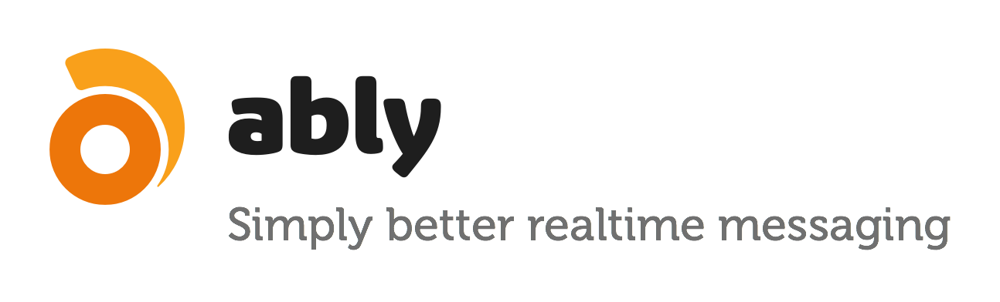

## Hosted Realtime Services

### General Messaging & PubSub

#### [Ably](https://www.ably.io)

* [Docs](https://www.ably.io/documentation)
* [Libraries](https://www.ably.io/download)
* [Pricing](https://www.ably.io/pricing)

> Ably is a platform that makes it easy for you add realtime messaging and streaming data to your application. The global service is uniquely able to offer solutions to the most difficult aspects of messaging at scale such as limitless scale, connection state recovery, guaranteed message delivery, client library "intelligence" to work around transient network problems. The Ably service operates in more than 24 data centres globally offering the lowest latencies globally.
>
> See the [complete feature set](https://www.ably.io/features).

* WebSocket
* HTTP Fallback
* XHR streaming
* HTTP polling 
* JSONP
* REST
* Presence
* Basic and Token based authentication
* Symmetric encryption
* Binary encoded data
* Push notifications
* WebHooks
* Android
* Cordova
* Go
* iOS
* Java Realtime
* JavaScript
* Mono
* .NET
* Node.JS
* PHP
* Python
* Ruby
* Xamarin

#### [Fanout](http://fanout.io)

* [Docs](https://fanout.io/docs/)
* [Pricing](https://fanout.io/pricing/)

> Build and scale realtime APIs. Fanout’s push CDN makes it easy. Add live updates to your websites and web services using REST, HTTP streaming, WebSockets, Webhooks, and XMPP
>
> For front-end applications, Fanout's JavaScript library receives realtime JSON notifications with just a few lines of code. Integration is quick and simple.
>
> For services and APIs, you can add realtime functionality with minimal modification. By acting as a reverse proxy, Fanout's global cloud invisibly bridges realtime clients with the services you've already built.

* WebHooks
* PubSub
* XMPP
* REST
* WebSockets
* HTTP Streaming
* HTTP Long-Polling
* REST

#### [Hydna](https://www.hydna.com/)

* [Docs](https://www.hydna.com/documentation/)
* [Libraries](https://www.hydna.com/documentation/#client-libraries)
* [Pricing](https://www.hydna.com/plans-and-pricing/)

> A scalable real-time platform
>
> Hydna is a hosted backend into which you can send data and have it instantly appear on other devices.
>
> Instantly move data across platforms, technologies, and devices
>
> Hydna is ideal for building dashboards, activity streams, notification- and chat systems, real-time collaboration, live statistics, remote controls, multiplayer games, and more.

* Real-Time messaging
* Binary
* WebSockets
* Comet
* Flash
* HTTP/REST
* Behaviors
* Routing
* Authentication
* Room partitioning
* Presence
* .NET
* Erlang
* Java
* Node.js
* Objective-C
* PHP
* Python
* Ruby
* Multiplexing

#### [PubNub](http://pubnub.com)

* [Docs](http://www.pubnub.com/documentation/)
* [Libraries](http://www.pubnub.com/developers)
* [Pricing](http://www.pubnub.com/pricing)

> Pubnub is the fastest cloud-hosted realtime messaging system for web and mobile apps.

* HTTP
* BOSH
* Fallback-support
* Real-Time Client Push
* Real-Time messaging
* Real-Time data
* Coldfusion
* .NET
* Erlang
* Google App Engine (GAE)
* Java
* JavaScript
* Lua-Corona
* node.js
* Objective-C
* Perl
* PHP
* Python
* Ruby
* Silverlight
* Titaniumf
* REST API
* PubSub

#### [Pusher](http://pusher.com)

* [Docs](http://pusher.com/docs)
* [Libraries](http://pusher.com/docs/libraries)
* [Pricing](http://pusher.com/pricing)

> Pusher is a hosted API for quickly, easily and securely adding scalable realtime functionality to web and mobile apps.

* WebSockets
* HTTP fallback
* Flash socket fallback
* Real-Time Client Push
* Real-Time messaging
* Real-Time Data
* in-built security
* HTML5
* JavaScript
* Objective-C
* Ruby
* PHP
* node.js
* .NET
* Silverlight
* ActionScript
* Google App Engine (GAE)
* Erlang
* Perl
* Coldfusion
* Python
* Groovy
* Java
* REST API
* Presence
* PubSub

#### [Realtime.co](http://framework.realtime.co)

* [Docs](http://messaging-public.realtime.co/documentation/starting-guide/overview.html)
* [Libraries](http://framework.realtime.co/messaging/#documentation)
* [Pricing](http://framework.realtime.co/messaging/#pricing)

> The Realtime Messaging Framework is a cloud-hosted messaging system for websites and mobile apps that require constant content updates in just a few milliseconds, enabling any application to interact with millions of connected users in a fast and secure way.

* Websockets
* Fallback-support (streaming and polling)
* Real-Time Client Push
* Real-Time messaging
* Real-Time data
* Mobile Push Notifications for iOS and Android (APNS and GCM)
* .NET
* Java / Android
* JavaScript
* Lua
* iOS
* Titanium Appcelerator
* Windows Phone
* Node.js
* Objective-C
* PHP
* Python
* C/C++
* Ruby
* Silverlight
* ActionScript
* React Native
* Xamarin
* Unity
* Cordova/PhoneGap
* Go
* Tessel (IoT)
* REST API
* Pub/Sub
* Presence
* built-in security (authentication and authorization)
* multiplexing (through the use of channels)
* HTML5 real-time enabled templating engine (xRTML)

#### [Streamdata.io](http://streamdata.io)

* [Docs](http://streamdata.io/doc/)
* [Pricing](http://streamdata.io/pricing/)
* [Libraries](https://github.com/streamdataio/)

> Streamdata.io is a real-time cache proxy allowing you to poll JSON REST APIs and push updates to clients. But wait, there is more: Streamdata.io keeps a history of modifications that occur on the data between two pollings! This way, streamdata.io is able to give you the list of modifications which happened since last time you fetched the data.

* Server-Sent Events
* JSON Patch
* Fallback-support
* REST
* PubSub
* Proxy
* JavaScript
* iOS
* Java
* Android

#### [Tambur.io](https://tambur.io)

* [Docs](https://www.tambur.io/documentation)
* [Pricing](https://www.tambur.io/pricing)
* [Libraries](https://github.com/tamburio/)

> Tambur.io provides your business with a simple messaging API to build scalable realtime web and mobile apps.

* Realtime messaging
* HTTP/REST
* SSL
* Websockets
* Comet
* Streams
* Modes
* Broadcast
* Unicast
* Authcast
* Presence
* Direct Messaging
* PHP
* Ruby
* Java
* .Net
* Erlang
* JavaScript

#### [WebSync on-demand (by FrozenMountain)](http://www.frozenmountain.com)

* Comet
* Real-Time Client Push
* Real-Time messaging
* Real-Time data

### Data Synchronisation, Persistence, Full Stack

#### [CloudBoost](https://cloudboost.io/)

* Open Source and hosted
* Data Storage
* Search
* Real-Time
* Relations
* Files
* Geospatial
* Authentication 
* Queues

#### [Firebase](http://firebase.com)

> A scalable real-time backend for your web app. Build apps really fast without the hassle of managing servers

* iOS
* Java / Android
* JavaScript
* WebSockets
* BaaS (Backend as a Service)

**[Acquired by Google](https://www.firebase.com/blog/2014-10-21-firebase-joins-google.html)**. Still active.

#### [Google Drive Realtime API](https://developers.google.com/drive/realtime/)

> Add Realtime collaboration to your app
Give your users the power of Google Docs–style collaboration.
All JavaScript. No server. No sweat.

#### [Meteor](http://meteor.com)

> Meteor is a set of new technologies for building top-quality web apps in a fraction of the time, whether you're an expert developer or just getting started.

* Node.js
* fullstack
* HTTP Streaming
* HTTP Long-polling
* WebSockets

*Not to be confused with the original Meteor Comet server*

#### [Realtime.co Cloud Storage](http://framework.realtime.co/storage)

* [Docs](http://storage-public.realtime.co/documentation/starting-guide/1.0.0/overview.html)
* [Libraries](http://framework.realtime.co/storage/#documentation)
* [Pricing](http://framework.realtime.co/storage/#pricing)

> The Realtime.co Cloud Storage is a highly-scalable backend-as-a-service based on Amazon DynamoDB. Built-in real-time notifications keep data synchronized between users (web and mobile).

* BaaS (Backend-as-a-Service)
* Real-time data sync
* JavaScript
* iOS
* Android (Java)
* Node.js
* React Native
* Unity
* NoSQL
* DynamoDB
* HTTP Streaming
* HTTP Long-polling
* WebSockets
* Mobile Push Notifications for iOS and Android (APNS and GCM)
* Server-side triggers and business logic

#### [simperium](https://simperium.com/)

> Simperium is a service for developers to move data everywhere it's needed, instantly and automatically.

### Messaging: with focus on delivery to servers

#### [Superfeedr](http://superfeedr.com/)
* RSS
* PubSubHubbub

#### [DataSift](http://datasift.com)

* Social Media data
* RSS
* HTTP Streaming

### Other

### [Echo](http://aboutecho.com)

## Self Hosted Realtime Solutions

### [apache-websocket](https://github.com/disconnect/apache-websocket)

> WebSocket module for Apache

* PHP
* WebSockets
* Apache

### [APE Project](http://www.ape-project.org/)

* WebSockets
* Comet

### [Alchemy Websockets](http://alchemywebsockets.net/)

> An extremely efficient C# WebSocket server for .NET projects.

* WebSockets
* .NET
* C#

### [ArduinoWebsocketServer](https://github.com/ejeklint/ArduinoWebsocketServer)

> This library implements a Websocket server running on an Arduino

* WebSockets
* Server
* Arduino

### [Atmosphere](https://github.com/Atmosphere/atmosphere)

* Comet
* WebSockets
* Scala
* Groovy
* Java

### [Autobahn WebSocket](http://autobahn.ws/)

> Autobahn provides Open-Source client and server implementations of WebSocket and WAMP.

* WebSockets
* Java
* Android

### [Beacon Push](http://beaconpush.com)

* WebSockets
* Comet
* Fallback-support
* Real-Time Client Push
* Real-time messaging
* Real-Time Data
* Python
* Ruby
* PHP
* node.js
* REST API

### [BrainSocket](http://brainsocket.brainboxmedia.ca/)

> A Laravel package that allows you to get up and running with real-time event-driven PHP apps using WebSockets.

* Laravel
* WebSockets
* PHP

### [Caplin System's Liberator](http://www.freeliberator.com/index.php)

* Comet
* WebSockets
* Fallback-support
* PubSub

### [Centrifugo](https://github.com/centrifugal/centrifugo)

> Real-time messaging server in Go language. This is a successor of [Centrifuge](https://github.com/centrifugal/centrifuge). Server has simple API to publish messages into channels, provides presence and history information and more. Javascript client available to communicate from web browser. See full documentation [on gitbooks.io](http://fzambia.gitbooks.io/centrifugal/content/index.html).

* Go
* JavaScript
* WebSockets
* SockJS
* HTTP-fallback
* Presence
* Event/Message history
* PubSub

### [cometD](http://cometdproject.dojotoolkit.org/)

* Comet

### [Cowboy](https://github.com/extend/cowboy)

* WebSockets
* Erlang

### [Cramp](http://cramp.in/)

* WebSockets
* Server Sent Events
* EventSource
* Ruby

### [Deepstream.io](http://deepstream.io/)

> Deepstream.io is a fast and easy to use realtime server written in node. It offers persistant data structures, RPC and PubSub messaging that works on both client and server. Deepstream can connect to a variety of caches and databases and scales horizontally across multiple servers.

* JavaScript
* WebSockets
* HTTP-fallback
* PubSub
* Persistant Data Structures
* RPC
* Events
* node.js

### [em-websocket](https://github.com/igrigorik/em-websocket)

> EventMachine based, async, Ruby WebSocket server.

* Ruby
* WebSockets
* Server

### [erlang_websocket](https://github.com/MiCHiLU/erlang_websocket)

* Erlang
* WebSockets
* Server

### [erlycomet](http://code.google.com/p/erlycomet/)

* Comet

### [FAYE](http://faye.jcoglan.com/)

* Real-Time messaging
* Bayeux
* node.js
* Ruby

### [Firehose.io](http://firehose.io)

> Firehose is a minimally invasive way of building realtime web apps without complex protocols or rewriting your app from scratch. Its a dirt simple pub/sub server that keeps client-side Javascript models in synch with the server code via WebSockets or HTTP long polling.

* WebSockets
* HTTP Long-Polling
* Ruby

### [Fleck](https://github.com/statianzo/Fleck)

> Fleck is a WebSocket server implementation in C#. Fleck requires no inheritance, container, or additional references.

* WebSockets
* .NET

### [Garufa](https://github.com/Juanmcuello/garufa)

> Garufa is an open source Ruby WebSocket server which implements the Pusher protocol. It is built on top of Goliath, a high performance non-blocking web server, and inspired by Slanger, another server compatible with Pusher.

* Open source
* Ruby
* Server
* WebSockets

### [Goliath](http://goliath.io)

* Ruby
* Asynchronous
* non-blocking
* HTTP Streaming

### [ICEfaces](http://www.icefaces.org/main/home/)

### [Java-WebSocket](http://java-websocket.org/)

> This repository contains a barebones WebSocket server and client implementation written in 100% Java. The underlying classes are implemented using the Java ServerSocketChannel and SocketChannel classes, which allows for a non-blocking event-driven model (similar to the WebSocket API for web browsers).

* Java
* WebSockets
* Server
* Client

### [Jetty](http://jetty.codehaus.org/jetty/)

* WebSockets
* HTTP Streaming

### [juggernaut](https://github.com/maccman/juggernaut) *[deprecated](http://blog.alexmaccaw.com/killing-a-library)*

* WebSockets
* Comet
* Fallback-support
* node.js

### [jwebsocket](http://code.google.com/p/jwebsocket/)

* Java
* WebSockets

### [Kaazing](http://kaazing.com/)

* WebSockets
* Fallback-support

### [libwebsockets](http://git.warmcat.com/cgi-bin/cgit/libwebsockets/)

> C Websockets Server Library

* C
* WebSockets
* Server

### [LightStreamer](http://lightstreamer.com/)

* Comet
* WebSockets

### [Meteor](http://meteorserver.org/)

* Comet
* Perl

### [Migratory](http://migratory.ro/)

* Comet
* WebSockets

### [misultin](https://github.com/ostinelli/misultin)

* WebSockets
* Erlang

### [Mojolicious](http://mojolicio.us/)

> A modern Perl web framework built from the ground-up as a nonblocking web server, including built-in support for web sockets.

* Full nonblocking web server
* WebSockets
* Perl

### [nowjs](https://github.com/Flotype/now)

* node.js

*Doesn't appear to be actively maintained any more and the website is down.*

### [Nugget](http://nugget.codeplex.com/)

> A web socket server implemented in c#.
>
> The goal of the projects is to create an easy way to start using HTML5 web sockets in .NET web applications.

* C#
* .NET

### [phpDaemon](http://daemon.io/)

> Asynchronous server-side framework for Web and network applications implemented in PHP using libevent. phpDaemon can handle thousands of simultaneous connections

* PHP

### [PHP WebSocket](http://code.google.com/p/phpwebsocket/)

* PHP
* WebSockets

### [Persevere](http://www.persvr.org/)

* Comet
* PubSub

### [Plezi](http://www.plezi.io)

> Plezi is an easy to use Ruby Websocket Framework, with full RESTful routing support and HTTP streaming support. It's name comes from the word "fun" in Haitian, since Plezi is really fun to work with and it keeps our code clean and streamlined.

* WebSockets
* Long Polling (supports RESTful HTTP routes)
* HTTP Streaming
* Ruby
* Rails/Sinatra/Rack integration

### [Pokein](http://pokein.com/)

* Comet
* ASP.NET
* Mono

### [Prosody](http://prosody.im/)

> Prosody is a modern flexible communications server for Jabber/XMPP written in Lua. It aims to be easy to set up and configure, and light on resources. For developers it aims to be easy to extend and give a flexible system on which to rapidly develop added functionality, or prototype new protocols.

* Jabber
* XMPP
* Lua
* BOSH

### [Ratchet](https://github.com/cboden/Ratchet)

> A PHP 5.3 (PSR-0 compliant) component library for serving/consuming sockets and building socket based applications. Build up your application (like Lego!) through simple interfaces using the decorator and command patterns. Re-use your application without changing any of its code just by wrapping it in a different protocol.

* PHP
* WebSockets

### [RethinkDB](http://rethinkdb.com)

* [Drivers](https://github.com/rethinkdb/rethinkdb#quickstart)
* [PubSub / Changfeeds](http://rethinkdb.com/docs/changefeeds/javascript/)
* [ReQL query language](http://rethinkdb.com/docs/introduction-to-reql/)

> RethinkDB is the first open-source scalable database built for realtime applications. It exposes a new database access model -- instead of polling for changes, the developer can tell the database to continuously push updated query results to applications in realtime. RethinkDB allows developers to build scalable realtime apps in a fraction of the time with less effort.

* Open-source
* database
* NoSQL
* schemaless JSON documents
* Distributed
* High availability
* automatic failover
* robust fault tolerance
* Javascript
* Python
* Ruby
* Go
* Elixir
* .NET

### [SignalR](https://github.com/SignalR/SignalR)

* WebSockets
* Long-polling
* ASP.NET
* IIS
* PubSub
* RMI

### [Slanger](https://github.com/stevegraham/slanger)

> Slanger is an open source server implementation of the Pusher protocol written in Ruby.

* Ruby
* WebSockets
* Server

### [socket.io](http://socket.io)

> Socket.IO aims to make realtime apps possible in every browser and mobile device, blurring the differences between the different transport mechanisms. It's care-free realtime 100% in JavaScript.

* WebSockets
* Fallback-support
* Flash Socket
* HTTP Long-Polling
* node.js
* Cross Domain Support

### [SockJS](https://github.com/sockjs/sockjs-client)

> SockJS is a browser JavaScript library that provides a WebSocket-like object. SockJS gives you a coherent, cross-browser, Javascript API which creates a low latency, full duplex, cross-domain communication channel between the browser and the web server.

* WebSockets
* Fallback-support
* HTTP Streaming
* HTTP Polling
* JSONP Polling
* Cross Domain support
* EventSource

### [SocketCluster](http://socketcluster.io/)

> A highly scalable realtime environment for Node.js
> SocketCluster is a new kind of engine which sits between Node.js and your code to provide you with a resilient, scalable, realtime architecture.
>
> With SC, you can build systems that make use of all CPU cores on a machine/instance. This removes the limitations of having to run your Node.js code as a single thread.
>
> SC also gives you the flexibility to scale up and scale out easily and at your own pace.

* Node.js

### [SocketTornad.IO](https://github.com/SocketTornadIO/SocketTornad.IO)

> Implementation of the Socket.IO Websocket emulation protocol in Python on top of the non-blocking Tornado Web Framework.

* Python
* WebSockets
* Server
* Client

### [Spike-Engine](http://www.spike-engine.com)

> Spike-Engine allows quick and painless creation of real-time web services in .NET. Spike-Engine focuses on latency, bandwith and perfomance and has been designed and proven to be robust and reliable. The technology has been tested in production environment with thousands of simultaneous connections and used to build reliable game and application servers.

* RPC
* Automatic Client Stub Generation
* WebSockets
* Fallback Support
* Cross-Domain Support
* Comet
* Long-Polling
* PubSub
* HTTP
* .NET
* Flash
* FlashSockets
* SPML / SECP
* HTTP Tunneling
* Security
* Cross-Platform
* Monitoring

### [StreamHub](http://www.stream-hub.com/)

### [SuperWebSocket, a .NET WebSocket server](http://superwebsocket.codeplex.com/)

* WebSockets,
* .NET

### [Thunder Push](https://github.com/thunderpush/thunderpush)

> Thunderpush is a Tornado and SockJS based push service. It provides a Beaconpush (beaconpush.com) inspired HTTP API and client.

* SockJS
* Python

### [Tornado](http://www.tornadoweb.org/en/stable/)

> Tornado is a Python web framework and asynchronous networking library, originally developed at FriendFeed. By using non-blocking network I/O, Tornado can scale to tens of thousands of open connections, making it ideal for long polling, WebSockets, and other applications that require a long-lived connection to each user.

Represents a core building block of many other realtime web servers.

### [UnderTow](http://undertow.io/)

> An asynchronous WebSocket and HTTP server in Java

* WebSockets
* Server Sent Events
* Java

### [webbit](http://webbitserver.org/)

> An event-based WebSocket and HTTP server in Java

* Java

### [WebSockets and Joomla](https://github.com/eddieajau/joomla-platform-examples/tree/sockets/web/socket)

* PHP
* WebSockets
* Joomla

### [ws4py](https://github.com/Lawouach/WebSocket-for-Python/tree/master/ws4py/server)

* Python
* WebSockets
* Server
* Client

### [XSockets](http://xsockets.net/)

* WebSockets
* .NET
* Fallback-support

### [YAWS (Yet Another Web Server)](http://yaws.hyber.org/)

* WebSockets
* HTTP Long-Polling
* HTTP Streaming
* Erlang

## WebSocket Client Libraries

### JavaScript - Flash Socket Fallback</dt>

* [web-socket-js](https://github.com/gimite/web-socket-js)

### ActionScript

* [AS3 WebSocket](https://github.com/Worlize/AS3WebSocket)

### .NET
* [Microsoft .NET 4.5 namespace and classes](http://msdn.microsoft.com/en-us/library/hh159285.aspx)
* [Anaida - WebSocket Client/Adapter](http://anaida.codeplex.com/)
* [Microsoft Windows Store app MessageWebSocket class](http://msdn.microsoft.com/en-us/library/windows/apps/windows.networking.sockets.messagewebsocket.aspx)
* [WebSocket Sharp](https://github.com/sta/websocket-sharp)
* [WebSocket4Net](http://websocket4net.codeplex.com/) - originated from the SuperWebSocket codebase

### Silverlight
[Silverlight WebSocket client](http://html5labs.interoperabilitybridges.com/prototypes/websockets/websockets/info) - prototype

### Java

* [Java WebSocket Client](http://code.google.com/p/weberknecht/)
* [UnittWebSocket](http://code.google.com/p/unitt/wiki/UnittWebSocket)
* [Java-WebSocket](http://java-websocket.org/)

### C++
* [Arduino C++ WebSocket client](https://github.com/krohling/ArduinoWebsocketClient)

### Ruby
* [web-socket-ruby"](https://github.com/gimite/web-socket-ruby)
* [em-websocket-client](https://github.com/mwylde/em-websocket-client)

### Python

* [ws4py](https://github.com/Lawouach/WebSocket-for-Python/tree/master/ws4py/client)
* [websocket-client](http://pypi.python.org/pypi/websocket-client/)

### Objective-C

* [ZTWebSocket](https://github.com/esad/zimt/blob/master/src/ZTWebSocket.m)
* [SocketRocket](https://github.com/square/SocketRocket) - Objective-C WebSocket Client (beta)
